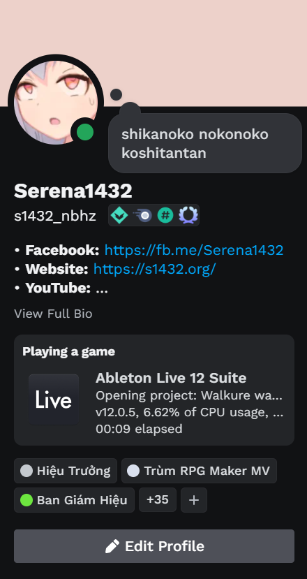

### This project is about to be reworked as a new one as described in [this GitHub issue](../../issues/15). I'm more than welcome to listen to your opinions about that.

# DAW Discord Rich Presence

This is a small C# application that supports showing what you're making on your Digital Audio Workstation (DAW) in your Discord account using Discord Rich Presence.

It will show as the following:



*What is happening with Discord's profile UI?*

## List of DAW currently supported

* FL Studio 11 or later
* Ableton Live 9 Intro or later (doesn't support Lite, Beta and Trial version)
* REAPER
* Bitwig Studio (fxxk Bitwig, you used more CPU and RAM than Ableton)
* Studio One
* LMMS
* Cubase 14

## Installation

Download the latest release version [here](https://github.com/lmharpae/DAWRPC/releases), extract it and run the `DAWRPC.exe` executable file. Open any supported DAW and enjoy the result!

## How does it work?

This app uses the [Process](https://docs.microsoft.com/en-us/dotnet/api/system.diagnostics.process) class to get the current running DAW process(es) and reads the project name from the process(es) window title.

## Dependencies used

* .NET Framework 4
* [DiscordRPC](https://github.com/Lachee/discord-rpc-csharp) by Lachee
* [Newtonsoft.Json](https://www.newtonsoft.com/json)
* [System.Windows.Forms](https://docs.microsoft.com/en-us/dotnet/api/system.windows.forms)
* [System.Diagnostics.Process](https://docs.microsoft.com/en-us/dotnet/api/system.diagnostics.process)
* [System.Diagnostics.PerformanceCounter](https://docs.microsoft.com/en-us/dotnet/api/system.diagnostics.performancecounter)

## Editing the source code

Download the latest source code from this repository above and open `DAWRPC.sln` in your Visual Studio that supports .NET Framework 4.

### You can add a new DAW support using this method:

* **Step 1:** Go to your [Discord Developer Portal](https://discord.com/developers/applications) and create a new application with the DAW name you want to support.
* **Step 2:** Go to your new application you have just created and click `Rich Presence -> App Assets`.
* **Step 3:** Add a new Rich Presence Asset Image with the DAW icon. Set the Asset Image Name into `icon`.
* **Step 4:** Open the `daws.json` file in your text editor, and add a new JSON object with these properties:

| Properties | Type | Description |
| --- | --- | --- |
| `ProcessName` | `string` | DAW's process name without `.exe` |
| `DisplayText` | `string` | The text to be displayed when detected in DAWRPC |
| `TitleRegex` | `string` | Regular expression from the DAW's window title. DAWRPC will take the first matched string as the "project name". |
| `ClientID` | `string` | Discord Client ID for displaying Rich Presence.
| `HideVersion` | `boolean` | Whether to hide the DAW version in DAWRPC. |

Here's the example for **Ableton Live 12 Suite**:

```json
{
    "ProcessName": "Ableton Live 12 Suite",
    "DisplayText": "Ableton Live 12 Suite",
    "TitleRegex": "^(.*?)(?= - Ableton Live 12 Suite)",
    "ClientID": "1256769208704958464",
    "HideVersion": false
}
```

* **Step 5:** Copy the edited `daws.json` file to the same folder with your `DAWRPC.exe` and run the application to test the newly added DAW.
* **Step 6:** After everything is okay, you can [send me a Pull Request](https://github.com/lmharpae/DAWRPC/compare) with your newly added DAW supporting in the source code.

## Contact the developer

You can contact the developer by using these social networks:

* [Discord](https://discord.com/users/693107293516070944)
* Facebook: `(temporarily not available)`
* YouTube: [Harpae](https://www.youtube.com/@lmharpae)
